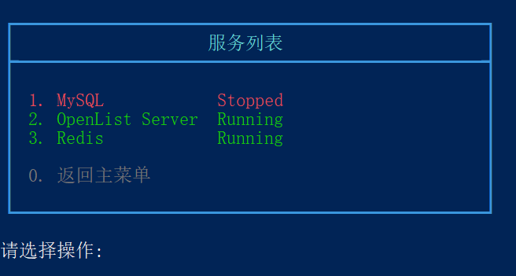
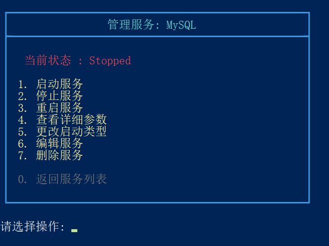

[English](./README.md) | 中文

# Windows 服务管理（WSM）

WSM（Windows Service Manager）是一个基于 PowerShell + [NSSM](https://nssm.cc/) 的交互式命令行工具，用于统一管理 Windows 服务，尤其适合管理 **由 NSSM 托管的自定义服务**（EXE / BAT / JAR / Python 等）。

该工具提供完整的菜单界面，支持服务查看、启动、停止、重启、删除、编辑、主题切换以及 NSSM 的自动安装。

## 运行示例





---

## ✨ 功能特性

- 自动检测并管理 **NSSM 托管的服务**
- 管理通过 `services.txt` 添加的自定义服务
- 服务操作：
  - 启动 / 停止 / 重启
  - 删除（双重确认，防误操作）
  - 修改启动类型（Automatic / Manual / Disabled）
- 查看服务详细参数：
  - 程序路径
  - 启动参数
  - 工作目录
- 一键调用 **NSSM 官方 GUI** 编辑服务
- 自动检测并 **在线安装 NSSM**
- 可切换主题（支持自定义主题脚本）
- 自动管理员权限提升
- 适配中英文显示宽度，对齐友好

---

## 🧩 运行环境要求

- Windows 10 / 11
- PowerShell 5.1
- 管理员权限（脚本会自动请求）
- 可访问互联网（仅在下载 NSSM 时需要）

---

## 📁 目录结构说明

```text
WSM.cmd                 # 启动入口
WSM.ps1                 # 主程序
services.txt            # 额外需要管理的服务列表
plugins/
 └─ Box.ps1             # 控制台 Box UI 插件
themes/
 ├─ xxx.ps1             # 主题文件
 └─ current_theme.txt   # 当前主题记录文件（自动生成）
```

---

## 🚀 使用方法

### 1️⃣ 运行脚本


本脚本支持 **cmd** 和 **ps1** 两种方式，其中`WSM.cmd`会以管理员身份运行`WSM.ps1`

---

#### 方法一：双击运行（推荐）

双击`WSM.cmd`文件运行

---

#### 方法二：在 PowerShell 中运行

首先关闭执行PowerShell 的脚本执行限制。
```
Set-ExecutionPolicy -Scope CurrentUser -ExecutionPolicy Bypass 
```

PowerShell 以管理员身份运行`WSM.ps1`

---

### 2️⃣ 主菜单功能

- **服务列表**：

	- 查看并管理所有 NSSM 服务及 `services.txt` 中定义的服务

- **添加新服务**：
	- 调用 NSSM 官方 GUI (`nssm install`)
	- 编辑自定义服务列表`services.txt`
	
- **程序设置**：
  - 安装NSSM
  - 切换主题
  
- **关于**：
  显示程序信息、版本、NSSM 信息及功能说明

---

## 📄 services.txt 说明

`services.txt` 用于补充需要管理的服务。(使用nssm添加的服务会自动管理)

示例：

```text
# 这里添加需要监控的服务
W32Time
MySQL
```

说明：

- 每行一个服务名（Service Name）
- 支持注释（`#` / `;` / `//`）
- 文件不存在时会自动创建

---

## 🎨 主题系统说明

- 所有主题文件位于 `themes` 目录
- 每个主题是一个 `.ps1` 文件
- 当前主题记录在 `current_theme.txt`
- 支持运行时切换，无需重启脚本

主题可配置项示例：

```powershell
# ==========================
# UI 主题配置说明
# ==========================
# $Global:UI 哈希表用于控制 WSM 菜单界面的样式和显示效果
# 可在运行时切换主题，支持修改颜色、边框样式、宽度等
# 字段说明：
#   Width           : 菜单/Box 宽度（字符数）
#   BorderColor     : 边框颜色
#   BoxStyle        : 边框样式（Double/Single/Heavy/Rounded/Ascii/Dotted）
#   TitleColor      : 菜单标题颜色
#   TextColor       : 列表文本颜色
#   TextPaddingLeft : 文本左侧缩进空格数
#   AccentColor     : 高亮或强调文字颜色（还没用到）
#   MutedColor      : 辅助或提示文字颜色（如“返回”按钮、次要信息）
$Global:UI = @{
    Width       = 50
    BorderColor = 'DarkGray'
    BoxStyle    = 'Heavy'
    TitleColor  = 'DarkYellow'
    TextColor   = 'Cyan'
    TextPaddingLeft = 2
    AccentColor = 'DarkYellow'
    MutedColor  = 'Gray'
}
```

---

## ⚙️ NSSM 支持说明

- 程序启动时自动检测程序所当前目录以及环境变量PATH中的 `nssm.exe`
- 未检测到时不会强制安装，仍可管理`services.txt`中添加的服务，但编辑功能和使用nssm添加服务功能无法使用
- 可在【设置】菜单中手动下载nssm安装
- 支持安装时加入系统 PATH

NSSM 官网：[nssm](https://nssm.cc)

---

## ⚠️ 注意事项

- 本工具 **必须以管理员权限运行**
- 删除服务操作不可恢复，请谨慎确认
- 编辑服务前请确认程序路径和参数正确
- 修改 PATH 会影响系统环境变量

---

## 📌 适用场景

- 将普通程序注册为 Windows 服务
- 管理 Java / Python / Node / 批处理 后台服务
- 运维或开发环境的服务统一管理
- 替代手动使用 `services.msc` 或 `sc.exe`

---

## 👤 作者信息

- 作者：zjw
- 项目主页：[wsm](https://github.com/Zhu-junwei/wsm)

---

## 📜 License

本项目（WSM）采用 MIT 许可证，允许自由使用、复制、修改和分发本项目代码，用于个人或商业用途。